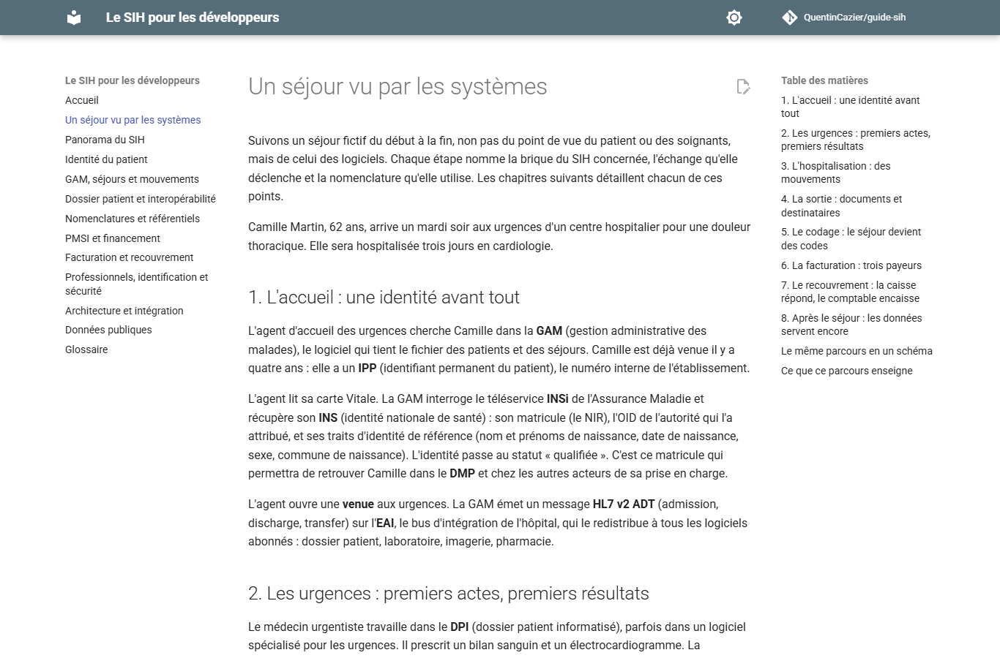

# Le SIH pour les développeurs

**Comprendre le système d'information hospitalier français quand on doit
écrire du code qui s'y branche.**

Vous arrivez sur un projet à l'hôpital et l'on vous parle de GAM, d'UF, de
mouvements HL7, de PMSI, de flux B2, de retours NOEMIE, d'INS et de Ségur.
Ce guide explique ce que sont ces briques, ce qu'elles s'échangent, qui fixe
les règles, et ce que cela change dans votre code. Il suit un séjour fictif
de l'accueil aux urgences jusqu'au paiement de la facture, puis reprend
chaque sujet en profondeur.

Site : <https://quentincazier.github.io/guide-sih/>



## Sommaire

1. [Un séjour vu par les systèmes](docs/parcours.md), le fil rouge
2. [Panorama du SIH](docs/panorama.md) : domaines, acteurs, programmes nationaux
3. [Identité du patient](docs/identite-patient.md) : IPP, NIR, INS, identitovigilance
4. [GAM, séjours et mouvements](docs/gam-mouvements.md) : structure, modes d'entrée et de sortie, HL7 PAM
5. [Dossier patient et interopérabilité](docs/dossier-patient.md) : DPI, HL7 v2, CDA, FHIR, DMP, MSSanté
6. [Nomenclatures et référentiels](docs/nomenclatures.md) : CIM-10, CCAM, NGAP, UCD, LOINC, FINESS, RPPS
7. [PMSI et financement](docs/pmsi.md) : RUM, RSS, GHM, GHS, T2A, DRUIDES
8. [Facturation et recouvrement](docs/facturation.md) : AMO, AMC, FIDES, B2, NOEMIE, ROC, Hélios
9. [Professionnels, identification et sécurité](docs/professionnels-securite.md) : RPPS, Pro Santé Connect, PGSSI-S, HDS
10. [Architecture et intégration](docs/architecture.md) : EAI, serveur d'identités, modes d'échange
11. [Données publiques](docs/donnees-publiques.md) : où trouver les référentiels et sous quelle licence
12. [Glossaire](docs/glossaire.md)

## Construire le site en local

Le site est généré par [MkDocs](https://www.mkdocs.org/) avec le thème
Material.

```bash
python -m venv .venv
.venv/bin/pip install -r requirements.txt     # sous Windows : .venv\Scripts\pip
.venv/bin/mkdocs serve                        # http://127.0.0.1:8000
```

## Contribuer

Une erreur, une imprécision, un sigle manquant, un retour de terrain : ouvrez
un ticket ou une proposition de modification. Règles : sources officielles
citées, aucune donnée réelle, pas de documentation d'éditeur. Voir
[CONTRIBUTING.md](CONTRIBUTING.md).

## Licence

Contenu sous licence [Creative Commons Attribution 4.0](LICENSE) (CC BY 4.0) :
vous pouvez le reprendre, le modifier et le rediffuser en citant la source.
Les extraits de code sont libres de tout droit.
