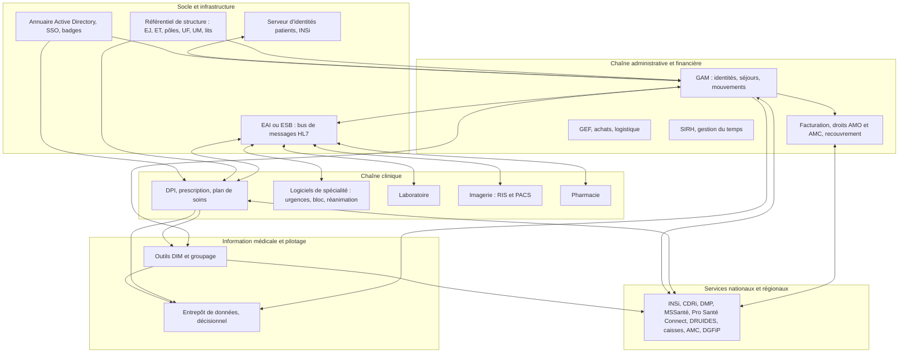

# Architecture et intégration

## Le paysage type

Aucun hôpital n'a exactement la même carte applicative, mais le schéma
ci-dessous se retrouve presque partout.

## Les briques d'intégration

### L'EAI

L'**EAI** (enterprise application integration), parfois appelé ESB ou moteur
d'intégration, reçoit les messages de la GAM et des autres producteurs, les
transforme au dialecte attendu par chaque destinataire, les route et les
rejoue en cas d'échec. C'est le point de passage de plusieurs centaines de
flux, et le premier endroit où l'on regarde quand « le patient n'apparaît pas
dans le logiciel ».

Ce que l'EAI fait bien : le routage, la transformation de segments, la
supervision des files. Ce qu'il ne fait pas à votre place : donner un sens
métier aux messages ni garantir l'ordre de traitement de bout en bout.

### Le serveur d'identités

Dans un GHT ou un établissement multi-sites, un **serveur d'identités**
(ou MPI, master patient index) rapproche les identités venues de plusieurs GAM,
porte l'INS et les fusions, et diffuse une identité de référence. C'est lui
qui appelle INSi.

### Le référentiel de structure

Une seule source de vérité pour les UF, les UM, les lits et leurs dates de
validité, diffusée aux applications par fichiers ou messages (HL7 MFN). Sans
lui, chaque logiciel a sa propre liste d'UF et rien ne se rapproche.

### L'entrepôt de données

Alimenté par la GAM, le DPI, le PMSI et la facturation, il sert au pilotage
(tableaux de bord de l'activité, des recettes, des rejets) et, lorsqu'il est
autorisé comme **entrepôt de données de santé**, à la recherche.

## Les modes d'échange que vous rencontrerez

| Mode | Où | Points d'attention |
|---|---|---|
| HL7 v2 sur MLLP | flux internes temps réel | accusés de réception, rejeu, dialectes |
| Fichiers plats déposés (SFTP, partages) | PMSI, facturation, paie, exports vers l'entrepôt | formats positionnels, encodages (souvent ISO-8859-1), calendriers |
| Services web SOAP | téléservices historiques de l'Assurance Maladie, DMP | certificats, enveloppes signées |
| API REST et FHIR | services nationaux récents, annuaires, applications modernes | OAuth 2 et OpenID Connect, pagination, versions |
| DICOM | imagerie | volumes, réseau, archivage long terme |
| Accès direct en base | à éviter, mais fréquent dans l'existant | couplage fort, aucune garantie de schéma |

## Environnements et données de test

Un hôpital dispose rarement de plus de deux environnements par application
(production et test, parfois formation). Les environnements de test sont
souvent des copies de production plus ou moins anonymisées : demandez
toujours ce qu'ils contiennent avant d'y brancher un outil, et n'y copiez
jamais des données réelles depuis la production sans procédure.

Pour développer, fabriquez des données synthétiques cohérentes : identités
fictives avec des NIR à clé valide, structures inventées, messages HL7
construits à partir des spécifications. Les échantillons publiés par l'ANS
(FINESS) et les jeux de test des téléservices sont utilisables.

## Ce que ça change dans votre code

- **Idempotence.** Le même message peut arriver deux fois. Identifiez chaque
  événement (identifiant de message, identifiant de mouvement) et rendez le
  traitement rejouable.
- **Tolérance aux dialectes.** Analyseur permissif, tables de correspondance
  externalisées, journal des champs inconnus.
- **Traçabilité de bout en bout.** Conservez l'identifiant du message
  d'origine dans vos données pour remonter au flux en cas de litige.
- **Reprise et rejeu.** Une file d'attente durable, un mécanisme de rejeu à
  partir d'une date, un tableau de bord des erreurs.
- **Supervision.** Exposez un point de santé et des métriques : nombre de
  messages traités, en erreur, en attente, dernier message reçu.
- **Encodages et dates.** ISO-8859-1 dans les fichiers anciens, UTF-8 dans
  les API ; dates au format `AAAAMMJJHHMMSS` en HL7 v2, ISO 8601 ailleurs.
  Normalisez à l'entrée.
- **Mise en production sans coupure.** Migrations compatibles, bascule
  progressive, retour arrière préparé.

## Pour aller plus loin

- ANS, [CI-SIS](https://esante.gouv.fr/interoperabilite/ci-sis)
- HL7 International, [spécifications v2 et FHIR](https://www.hl7.org/)
- IHE, [profils d'intégration](https://www.ihe.net/)
