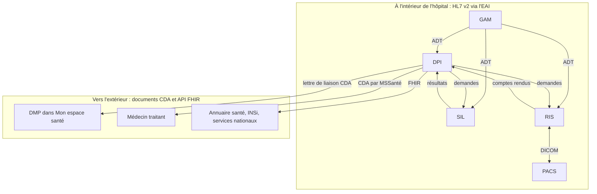

# Dossier patient et interopérabilité

## Le DPI

Le **DPI** (dossier patient informatisé) est le logiciel dans lequel médecins,
infirmiers et autres soignants documentent la prise en charge : observations,
prescriptions, plan de soins, comptes rendus, courriers. Dans beaucoup
d'établissements il regroupe aussi la prescription médicamenteuse, le circuit
du médicament et la gestion des rendez-vous.

Autour du DPI gravitent des **logiciels de spécialité** (urgences,
réanimation, bloc opératoire, obstétrique, dialyse, oncologie) et les
**plateaux techniques** :

| Système | Rôle | Standards courants |
|---|---|---|
| **SIL** (laboratoire) | réception des demandes, exécution des analyses, résultats | HL7 v2 (demandes et résultats), LOINC, NABM |
| **RIS** (radiologie) | planification, réalisation, comptes rendus d'imagerie | HL7 v2, DICOM pour le lien avec le PACS |
| **PACS** | archivage et distribution des images | DICOM, DICOMweb, IHE XDS-I |
| Pharmacie à usage intérieur | validation pharmaceutique, dispensation, stocks | HL7 v2, UCD, CIP |
| Anatomopathologie, biologie moléculaire | comptes rendus, prélèvements | HL7 v2, CDA |

## Trois familles de standards

Le SIH parle trois langues, qui coexistent et coexisteront longtemps.

### HL7 version 2

Messages texte segmentés, transportés en MLLP ou par fichiers. C'est le
standard des flux internes : mouvements (ADT), demandes d'examens (ORM, OML),
résultats (ORU), rendez-vous (SIU). Robuste, universel, mais chaque éditeur a
son dialecte : les « Z segments » et les positions exactes se négocient
interface par interface, à partir des spécifications du CI-SIS et des profils
IHE (PAM pour l'administratif, LTW et LAW pour le laboratoire, SWF pour
l'imagerie).

### CDA et le CI-SIS

Le **CI-SIS** (cadre d'interopérabilité des systèmes d'information de santé),
publié par l'ANS, définit les **documents** échangés : lettre de liaison,
compte rendu d'imagerie, compte rendu de biologie, volet de synthèse médicale,
et bien d'autres. Le format est **CDA R2** (Clinical Document Architecture),
un XML HL7 avec un en-tête normalisé (patient, auteur, établissement) et un
corps lisible par un humain, éventuellement structuré. Les codes viennent du
**MOS** et des **NOS** (modèle et nomenclatures des objets de santé).

Ces documents sont ceux qui partent vers le DMP et par MSSanté.

### FHIR

**FHIR** (Fast Healthcare Interoperability Resources) est le standard HL7
moderne : des ressources JSON ou XML (Patient, Encounter, Observation,
Practitioner…) exposées en API REST. En France, l'ANS publie des guides
d'implémentation FHIR (dont les profils « FR Core ») et expose déjà des
services en FHIR : l'annuaire santé (professionnels et structures), une partie
de FINESS. Les nouveaux services nationaux et les échanges avec l'extérieur
basculent progressivement en FHIR ; les flux internes des hôpitaux restent
majoritairement en HL7 v2.

## Les services nationaux que le DPI doit alimenter

### DMP et Mon espace santé

Le **DMP** (dossier médical partagé) est le carnet de santé numérique de
chaque assuré, intégré depuis 2022 dans **Mon espace santé**. Les
établissements ont l'obligation d'y déposer certains documents (lettre de
liaison, comptes rendus, ordonnances…), sous forme de CDA référencés par
l'INS. Le dépôt s'appuie sur les transactions IHE **XDS** encapsulées dans les
API du DMP, avec authentification de l'établissement ou du professionnel.

### MSSanté

**MSSanté** est l'espace de confiance des messageries sécurisées de santé :
des domaines de messagerie opérés par des acteurs habilités, un annuaire
national des boîtes aux lettres, et des règles techniques (chiffrement,
authentification des opérateurs). Un établissement dispose de boîtes
nominatives, organisationnelles et applicatives ; le DPI envoie les
documents de sortie par ce canal, avec le document CDA en pièce jointe et un
volet lisible.

### Pro Santé Connect et l'identification des professionnels

Pour appeler ces services, le professionnel ou l'établissement doit être
authentifié : carte CPS, application e-CPS via **Pro Santé Connect**, ou
certificats d'établissement. Voir
[Professionnels, identification et sécurité](professionnels-securite.md).

## Le Ségur du numérique côté DPI

Le Ségur du numérique finance la mise à niveau des DPI (couloir « hôpital »)
contre des exigences vérifiables : intégration de l'INS, alimentation du DMP,
envoi par MSSanté, authentification par Pro Santé Connect, production des
documents CDA du CI-SIS, réception des documents. Un DPI « référencé Ségur »
a passé ces contrôles. Les vagues successives élargissent le périmètre (par
exemple la réception et l'intégration des documents et des résultats venant de
l'extérieur).

## Ce que ça change dans votre code

- **Un document clinique a un cycle de vie** : versions, remplacement,
  annulation. Le CDA porte ces liens (`relatedDocument`). Ne considérez jamais
  un document comme immuable.
- **Codez les métadonnées avec les NOS** : type de document, spécialité,
  cadre de soins. Les listes sont publiées et versionnées par l'ANS.
- **Séparez le contenu du transport.** Le même CDA part au DMP, par MSSanté et
  dans l'entrepôt de données ; générez-le une fois.
- **Prévoyez la lecture d'HL7 v2 dialectal.** Un analyseur tolérant, des
  tables de correspondance configurables, et des tests avec des messages
  réels anonymisés fournis par l'éditeur en face.
- **FHIR pour l'externe, v2 pour l'interne** est la règle pratique
  aujourd'hui ; prévoyez la bascule en isolant vos modèles métier des formats.

## Pour aller plus loin

- ANS, [CI-SIS](https://esante.gouv.fr/interoperabilite/ci-sis) et
  [guides d'implémentation FHIR](https://interop.esante.gouv.fr/)
- ANS, [DMP pour les industriels](https://industriels.esante.gouv.fr/) et
  [MSSanté](https://esante.gouv.fr/produits-services/mssante)
- HL7 International, [FHIR](https://hl7.org/fhir/)
- IHE France, profils nationaux
