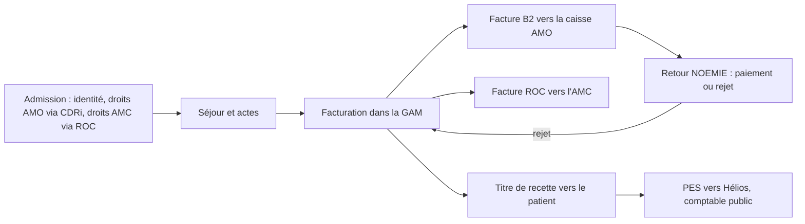

# Facturation et recouvrement

La facturation hospitalière est la partie du SIH où se rencontrent le plus
d'acteurs extérieurs, de normes anciennes et de règles changeantes. C'est
aussi celle où une erreur se voit tout de suite : la caisse rejette, l'argent
ne rentre pas.

## Qui paie quoi

Un séjour ou une consultation est financé par jusqu'à trois débiteurs :

| Débiteur | Part | Comment on vérifie les droits |
|---|---|---|
| **AMO** (assurance maladie obligatoire : régime général, MSA, régimes spéciaux) | la part principale, souvent 80 % ou 100 % selon la situation (ALD, maternité, accident du travail…) | téléservice **CDRi** (consultation des droits intégrée) depuis la GAM, ou lecture de la carte Vitale |
| **AMC** (assurance maladie complémentaire : mutuelles, assureurs, institutions de prévoyance) | le ticket modérateur, le forfait journalier, la chambre particulière selon le contrat | dispositif **ROC**, ou à défaut la carte de tiers payant papier |
| Le patient | ce qui reste : forfait journalier, participation forfaitaire, chambre particulière non couverte, dépassements | encaissement en régie, ou **titre de recette** envoyé au patient |

Un patient sans droits ouverts (étranger de passage, situation irrégulière,
droits non à jour) relève de dispositifs spécifiques (soins urgents, AME) ou
est débiteur de la totalité.

## Deux modes de facturation à l'AMO

Historiquement, les établissements publics ne facturaient pas chaque séjour à
la caisse : ils transmettaient leur PMSI à l'ATIH, qui **valorisait**
l'activité, et la caisse « pivot » de l'établissement versait le montant
correspondant. Le programme **FIDES** (facturation individuelle des
établissements de santé) remplace progressivement ce circuit par une
**facture par prestation**, envoyée directement à la caisse du patient.

- Les **actes et consultations externes** (ACE) sont facturés
  individuellement dans la grande majorité des établissements depuis les
  années 2010.
- Les **séjours** basculent par vagues : expérimentations, puis déploiement
  progressif ; un arrêté fixe régulièrement la liste des établissements qui
  démarrent et leur périmètre (par exemple l'arrêté du 31 mars 2026), et la
  dérogation au régime de valorisation prend fin au plus tard le
  1er mars 2027 selon les textes en vigueur.

Le secteur privé lucratif facture individuellement depuis toujours.

## La norme B2

Les factures partent vers les caisses au format **B2**, une norme de
l'Assurance Maladie : fichiers texte à enregistrements de longueur fixe,
organisés en types d'enregistrement (en-tête de lot, début de facture,
prestations, fin de facture, fin de lot), avec des dizaines de zones
positionnelles (numéro FINESS de l'établissement, NIR de l'assuré, code
régime et caisse gestionnaire, codes actes, montants, taux). Le **cahier des
charges B2** publié par la CNAM décrit chaque zone ; les établissements
utilisent sa déclinaison hospitalière.

Les fichiers sont déposés sur des plateformes d'échange (les flux passent par
des concentrateurs et des télétransmissions sécurisées), puis traités par la
caisse.

## Les retours NOEMIE

La caisse répond par des flux **NOEMIE** (norme ouverte d'échange entre la
maladie et les intervenants extérieurs) : accusés de réception, **paiements**
et **rejets**. Chaque rejet porte un code et un libellé de motif (droits non
ouverts, acte incompatible, doublon, période de facturation…). Pour les
établissements de santé, la référence utilisée est le retour NOEMIE de type
**908**, dont les enregistrements listent les factures acceptées, rejetées ou
en attente.

Le traitement des rejets est un travail quotidien du **bureau des entrées** :
analyser le motif, corriger (souvent une identité ou un droit), refacturer.
Un bon outil de suivi des rejets vaut de l'argent.

## ROC : le tiers payant complémentaire

Le dispositif **ROC** (remboursement des organismes complémentaires), porté
par le ministère dans le programme SIMPHONIE, normalise les échanges entre
établissements et AMC :

1. **Identification des droits** (IDB) en ligne au moment de l'admission :
   l'établissement interroge l'AMC pour connaître la couverture du patient.
2. **Simulation** du montant pris en charge sur une prestation donnée.
3. **Facturation** dématérialisée à l'AMC, puis **paiement** et retour
   normalisé.

Le déploiement suit l'équipement des GAM et l'adhésion des AMC ; en
l'absence de ROC, le tiers payant complémentaire reste un échange manuel de
prises en charge, ou le patient avance les frais.

## Titres de recette et comptabilité publique

Dans un établissement public, la facturation obéit à la séparation de
l'**ordonnateur** (le directeur, qui constate la recette et émet le titre) et
du **comptable public** (le Trésor, via la DGFiP, qui encaisse et poursuit).
Les titres de recette et leurs pièces justificatives partent vers
l'application **Hélios** de la DGFiP au format **PES** (protocole d'échange
standard) ; les flux financiers reviennent de la même manière. Le patient
reçoit un avis des sommes à payer et peut régler en ligne ou auprès du Trésor.

## Ce que ça change dans votre code

- **Les formats sont positionnels et versionnés.** B2, NOEMIE, PES : lisez
  toujours le cahier des charges de la version en vigueur, et gardez les
  versions précédentes pour relire les flux anciens.
- **Une facture a une date de soins et une date d'émission.** Les tarifs, les
  droits et les règles sont ceux de la date de soins.
- **Les rejets sont des données de premier ordre.** Stockez-les, indexez-les
  par motif, mesurez-les : c'est le tableau de bord que la direction des
  finances attend.
- **Identité et droits sont la cause de la majorité des rejets.** Un défaut
  d'identitovigilance se paie ici.
- **Ne stockez pas plus que nécessaire.** Un flux B2 contient des NIR et des
  données médicales codées : il est aussi sensible qu'un dossier.

## Pour aller plus loin

- Assurance Maladie, cahiers des charges des normes B2 et NOEMIE (espace
  éditeurs et établissements)
- Ministère de la Santé, [programme SIMPHONIE](https://sante.gouv.fr/) et
  [FIDES](https://sante.gouv.fr/)
- ANS, [dispositif ROC](https://esante.gouv.fr/)
- Légifrance, code de la sécurité sociale, articles R174-2-1 et suivants
  (facturation individuelle)
