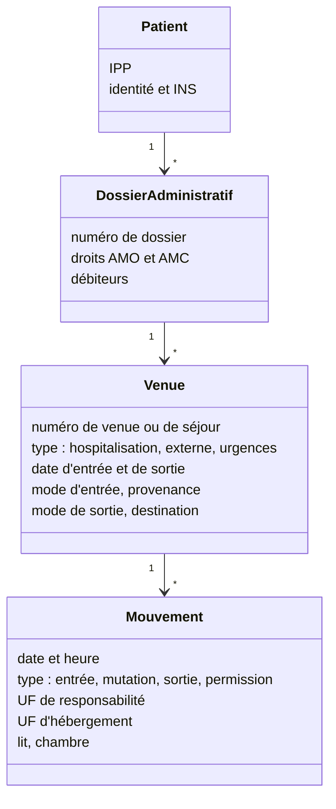

# GAM, séjours et mouvements

La **GAM** (gestion administrative des malades, parfois GAP pour gestion
administrative du patient) est le cœur administratif du SIH. Elle tient le
fichier des patients, ouvre et ferme les séjours, enregistre où se trouve
chaque patient à chaque instant, et prépare la facturation. Presque tous les
autres logiciels dépendent d'elle.

## Le modèle : patient, dossier, venue, mouvement



Le vocabulaire varie d'un éditeur à l'autre (venue, séjour, épisode, dossier),
mais la structure est la même : une **venue** est un contact avec
l'établissement (une hospitalisation, une consultation externe, un passage aux
urgences) ; un **mouvement** est un changement d'unité ou de lit à l'intérieur
de la venue.

## La structure de l'établissement

Un mouvement rattache le patient à une unité. La structure hospitalière est
un arbre à plusieurs niveaux, dont les noms sont réglementaires :

| Niveau | Définition | Exemple |
|---|---|---|
| **Entité juridique** (EJ) | la personne morale, identifiée par un numéro FINESS EJ | Centre hospitalier de la ville |
| **Établissement géographique** (ET) | un site, identifié par un numéro FINESS ET | l'hôpital principal, l'EHPAD rattaché |
| **Pôle** | regroupement de services défini par l'établissement | pôle médecine |
| **Service** | unité d'organisation médicale | service de cardiologie |
| **UF** (unité fonctionnelle) | plus petite unité de découpage, à la fois budgétaire, analytique et de responsabilité médicale | UF hospitalisation complète cardiologie |
| **UM** (unité médicale) | unité de production de soins au sens du PMSI ; regroupe une ou plusieurs UF | UM cardiologie |
| Lit, chambre, place | ressource d'hébergement | chambre 204, lit A |

Deux notions coexistent souvent sur un mouvement : l'**UF de responsabilité
médicale** (qui prend en charge le patient) et l'**UF d'hébergement** (où il
dort). Un patient de cardiologie hébergé dans un lit de pneumologie faute de
place reste sous la responsabilité de la cardiologie.

Le **référentiel de structure** (souvent un module de la GAM, parfois un
logiciel dédié) est la source de vérité de cet arbre. Il change : ouvertures
et fermetures d'UF, réorganisations de pôles chaque année. Toute application
qui stocke des codes UF doit savoir gérer ces dates de validité.

## Modes d'entrée et de sortie

Le PMSI impose des codes pour qualifier le début et la fin d'un séjour, que la
GAM saisit :

| Mode d'entrée | Sens |
|---|---|
| 8 | domicile |
| 7 | transfert depuis un autre établissement |
| 6 | mutation depuis une autre unité du même établissement |
| 0 | transfert provisoire |

| Mode de sortie | Sens |
|---|---|
| 8 | domicile |
| 7 | transfert vers un autre établissement |
| 6 | mutation vers une autre unité |
| 9 | décès |

Un code de **provenance** (à l'entrée) ou de **destination** (à la sortie)
précise le type de structure concernée : unité de MCO, de SMR, de
psychiatrie, HAD, structure d'hébergement médico-sociale, passage par les
urgences de l'établissement. Les listes exactes de codes et leurs libellés
sont dans les guides méthodologiques et les formats PMSI publiés chaque année
par l'ATIH : reprenez-les depuis la source plutôt que de mémoire.

## Les messages : HL7 v2 et le profil PAM

La GAM diffuse ses événements sous forme de messages **HL7 version 2**,
messages texte segmentés (MSH, EVN, PID, PV1…) transportés le plus souvent en
**MLLP** (un protocole minimal sur TCP). En France, la quasi-totalité des
établissements utilisent le profil **IHE PAM** (Patient Administration
Management) dans son extension française, qui fixe les événements, les
segments et les codes.

| Événement ADT | Sens |
|---|---|
| A28, A31 | création, mise à jour d'une identité |
| A05 | pré-admission |
| A01 | admission (hospitalisation) |
| A04 | inscription d'une venue externe |
| A02 | mutation (changement d'unité) |
| A03 | sortie |
| A08 | mise à jour de la venue |
| A11, A12, A13 | annulation d'admission, de mutation, de sortie |
| A21, A22 | départ et retour de permission |
| A40 | fusion de deux identités |
| Z99 avec segment ZBE | mouvement au sens PAM France : entrée, mutation, sortie, changement d'UF de responsabilité, avec annulation et correction |

Le segment **ZBE**, propre à l'extension française, porte l'identifiant du
mouvement, sa nature, les UF de responsabilité et d'hébergement, et l'action
(insertion, annulation, mise à jour). C'est lui qui permet de rejouer
correctement l'historique.

```text
MSH|^~\&|GAM|CH_EXEMPLE|DPI|CH_EXEMPLE|20260911083000||ADT^A01^ADT_A01|MSG00001|P|2.5
EVN||20260911083000
PID|||1234567^^^CH_EXEMPLE^PI~2550149588157^^^ASIP-SANTE-INS-NIR&1.2.250.1.213.1.4.8&ISO^INS||MARTIN^CAMILLE^^^^^L||19550112|F
PV1||I|CARDIO^204^A^CH_EXEMPLE||||||||||||||||SEJ2026000123
ZBE|MVT000045^CH_EXEMPLE|20260911083000||INSERT|N||UF_CARDIO_HC^^^^^^UF^^^HOSPITALISATION|UF_CARDIO_HC
```

Exemple fictif et simplifié : identifiants, structure et valeurs sont
inventés. La spécification PAM France de l'ANS fait foi pour les positions et
les tables de valeurs.

## Ce que ça change dans votre code

- **Écoutez les mouvements, ne les devinez pas.** Si votre application doit
  savoir où est un patient, abonnez-la aux messages ADT via l'EAI plutôt que
  de lire la base de la GAM.
- **Les messages arrivent dans le désordre et se corrigent.** Une sortie peut
  être annulée (A13), une mutation datée rétroactivement, un mouvement
  supprimé. Stockez l'identifiant de mouvement du ZBE et traitez les
  annulations.
- **Accusez réception** (message ACK) seulement quand vous avez réellement
  persisté le message : l'EAI se fie à votre réponse pour rejouer ou non.
- **Séparez responsabilité et hébergement**, et gardez les deux UF.
- **Versionnez la structure.** Un code UF a une date de début et de fin.
- **Fusion d'identités** : prévoyez le traitement de l'A40 dès la conception.

## Pour aller plus loin

- ANS, [CI-SIS, volet gestion administrative du patient (PAM)](https://esante.gouv.fr/interoperabilite/ci-sis)
- IHE International, profil [PAM](https://profiles.ihe.net/ITI/TF/Volume1/ch-14.html)
- ATIH, guides méthodologiques et formats de recueil de chaque champ PMSI
