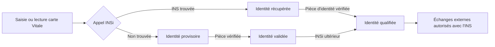

# Identité du patient

Tout commence par savoir de qui l'on parle. Dans un hôpital, un patient porte
plusieurs identifiants, chacun avec un rôle précis. Les confondre est la
première source d'erreurs, et parfois d'accidents.

## Les identifiants

| Identifiant | Qui l'attribue | Portée | Forme |
|---|---|---|---|
| **IPP** (identifiant permanent du patient) | l'établissement, via la GAM ou un serveur d'identité | local à l'établissement ou au GHT | numéro interne, souvent numérique |
| **NIR** (numéro d'inscription au répertoire), le « numéro de sécurité sociale » | l'INSEE | national, à vie | 13 chiffres et une clé de 2 chiffres |
| **NIA** (numéro identifiant d'attente) | la CNAV, en attendant le NIR | national, temporaire | même format que le NIR |
| **INS** (identité nationale de santé) | recherchée via le téléservice INSi de la CNAM | national, pour toute prise en charge sanitaire et médico-sociale | matricule (NIR ou NIA) + OID + traits de référence |
| Numéro de séjour, de venue, de dossier administratif | la GAM | local | numéro interne |

L'IPP identifie un **dossier** dans un établissement ; l'INS identifie une
**personne** au niveau national. Un même patient a un IPP différent dans chaque
hôpital, mais une seule INS.

## Le NIR

Le NIR se lit ainsi : sexe (1 chiffre), année de naissance (2), mois (2),
département de naissance (2, avec `2A` et `2B` pour la Corse et `99` pour
l'étranger), commune ou pays (3), numéro d'ordre (3), puis une clé de contrôle
sur 2 chiffres.

La clé vaut `97 - (NIR mod 97)`, le NIR étant pris comme un nombre de
13 chiffres. Pour la Corse, on remplace `2A` par `19` et `2B` par `18` avant le
calcul.

```js
function cleNir(nir13) {
  const n = nir13.toUpperCase().replace('2A', '19').replace('2B', '18');
  return String(97 - (Number(BigInt(n) % 97n))).padStart(2, '0');
}
cleNir('2550149588157'); // '23' (numéro fictif)
```

Le NIR est une donnée sensible au sens du RGPD : son usage est encadré par
décret, et l'usage dans le domaine de la santé est justement ce que le
référentiel INS autorise.

## L'INS

Depuis le 1er janvier 2021, toute donnée de santé doit être référencée avec
l'INS (décret n° 2019-1036 du 8 octobre 2019). L'INS se compose de :

- le **matricule INS** : le NIR, ou le NIA pour les personnes en cours
  d'immatriculation ;
- l'**OID** de l'autorité d'affectation, qui distingue notamment un NIR d'un
  NIA ;
- les **traits stricts de référence** : nom de naissance, liste des prénoms de
  naissance, date de naissance, sexe, code INSEE du lieu de naissance.

On ne saisit pas une INS : on la **récupère** auprès du téléservice **INSi**
de l'Assurance Maladie, intégré dans la GAM, soit par lecture de la carte
Vitale, soit par recherche à partir des traits. Le téléservice renvoie
l'identité de référence, et l'établissement la compare à ce qu'il a saisi.

### Les statuts de l'identité

Le **RNIV** (référentiel national d'identitovigilance) définit quatre statuts,
qui conditionnent ce qu'on a le droit de faire avec l'identité :

| Statut | Signification |
|---|---|
| Provisoire | identité saisie, ni vérifiée par pièce d'identité ni récupérée auprès d'INSi |
| Récupérée | INS obtenue auprès d'INSi, mais pièce d'identité non vérifiée |
| Validée | pièce d'identité à haut niveau de confiance vérifiée, INS non récupérée |
| Qualifiée | INS récupérée et pièce d'identité vérifiée |

Seule une identité **qualifiée** permet d'échanger des données avec l'INS vers
l'extérieur (DMP, MSSanté, autres établissements). Le référentiel INS de l'ANS
et le RNIV précisent ces règles.

## L'identitovigilance

L'**identitovigilance** est l'organisation qui prévient et corrige les erreurs
d'identité : doublons (deux IPP pour une même personne), collisions (deux
personnes sous un même IPP), usurpations, homonymies. Chaque établissement a
une cellule d'identitovigilance et des procédures de **fusion** et de
**dé-fusion** de dossiers.

Pour les systèmes, la fusion est l'opération la plus délicate : tous les
logiciels qui ont copié l'identité doivent être informés (message HL7 ADT
A40 dans le profil PAM), et chacun doit savoir rattacher les données de l'IPP
absorbé à l'IPP conservé.



## Les règles d'affichage et de saisie

Le RNIV impose des règles concrètes : nom de naissance en majuscules sans
accents pour la recherche, prénoms de naissance dans l'ordre de l'état civil,
distinction nom de naissance et nom utilisé, prénom utilisé, date de
naissance complète. Les logiciels doivent afficher au minimum le nom de
naissance, le premier prénom de naissance, la date de naissance et le sexe,
ainsi que le statut de l'identité.

## Ce que ça change dans votre code

- **L'IPP est votre clé locale, l'INS est un attribut.** Ne faites jamais du
  NIR une clé primaire ni un identifiant technique : il peut être absent
  (nouveau-né, personne étrangère, urgence), temporaire (NIA), rectifié, et son
  usage est juridiquement encadré.
- **Stockez l'INS complète** : matricule, OID, traits de référence, statut et
  date de récupération. Un matricule seul ne vaut rien.
- **Ne créez jamais une INS vous-même** : elle vient d'INSi, via la GAM ou le
  serveur d'identité. Votre logiciel la reçoit, il ne l'invente pas.
- **Gérez la fusion.** Toute donnée rattachée à un patient doit pouvoir changer
  d'IPP en conservant son historique.
- **Journalisez** les consultations et modifications d'identité : c'est une
  exigence de traçabilité et un outil d'identitovigilance.
- **Testez avec des identités fictives.** Les jeux de test de la CNAM pour
  INSi existent ; ne copiez jamais des identités réelles dans un environnement
  de développement.

## Pour aller plus loin

- ANS, [Référentiel INS](https://esante.gouv.fr/produits-services/referentiel-ins)
- Réseau des référents en identitovigilance, [RNIV](https://www.identito-na.fr/)
- CNAM, documentation du téléservice INSi pour les éditeurs (via le portail
  industriels de l'ANS et l'espace éditeurs de l'Assurance Maladie)
