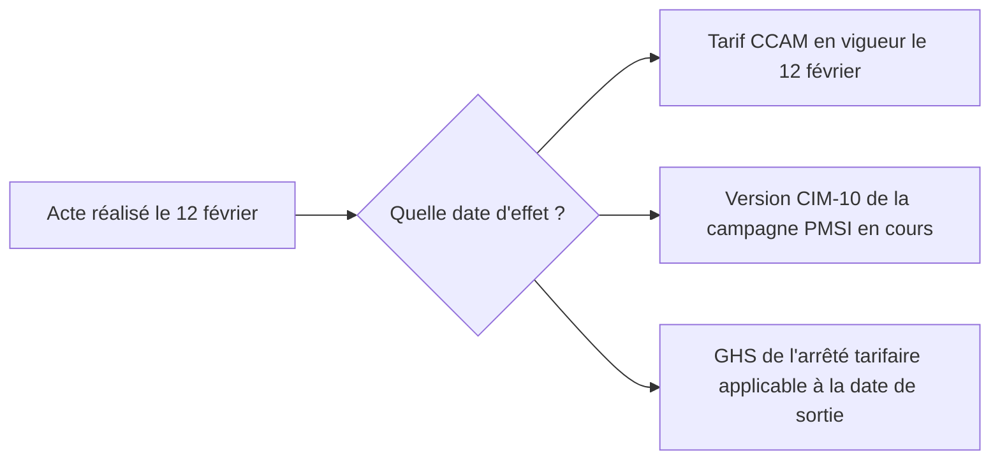

# Nomenclatures et référentiels

> Dernière vérification des sources : 11 septembre 2026. Les règles et les
> tarifs cités évoluent chaque année ; les liens en fin de chapitre font foi.

Un SIH manipule des dizaines de listes de codes officielles. Les connaître
évite de réinventer des tables, et surtout de se tromper de code au mauvais
endroit : un acte a un code pour le soin, le PMSI et la facture ; ce n'est pas
toujours le même.

## Ce que chaque nomenclature code

| Nomenclature | Ce qu'elle code | Qui la publie | Forme du code |
|---|---|---|---|
| **CIM-10 FR à usage PMSI** | diagnostics et motifs de recours | ATIH, d'après la CIM-10 de l'OMS | lettre + chiffres, par exemple `I21.0` ; l'ATIH ajoute des extensions françaises |
| **CCAM** | actes techniques médicaux (chirurgie, imagerie, actes interventionnels) | CNAM et ministère, versions successives (V84 en 2026) | 4 lettres + 3 chiffres, par exemple `ZBQK002`, complété par activité, phase, modificateurs |
| **NGAP** | actes cliniques et consultations non couverts par la CCAM, lettres clés | CNAM | lettres clés et coefficients, par exemple `C`, `CS`, `APC` |
| **NABM** | actes de biologie médicale | CNAM | code numérique |
| **LPP** | dispositifs médicaux et prestations remboursables | CNAM | code numérique à 7 chiffres |
| **UCD** et **CIP** | médicaments : unité commune de dispensation (hôpital) et code présentation (ville) | ANSM, CIP | UCD 7 ou 13 chiffres, CIP 13 chiffres |
| **ATC** | classes de médicaments | OMS | lettres et chiffres, par exemple `C09AA05` |
| **LOINC** | analyses de biologie et observations, pour l'interopérabilité | Regenstrief, traduction française portée par l'ANS | numérique avec clé, par exemple `2160-0` |
| **SNOMED CT** | terminologie clinique de référence internationale | SNOMED International, la France y adhère depuis 2023 | identifiants numériques |
| **GHM** et **GHS** | groupes homogènes de malades et de séjours | ATIH et arrêté tarifaire | `01C031`, puis numéro de GHS |
| **FINESS** | établissements et entités juridiques sanitaires et sociaux | ANS (historiquement ministère et DREES) | 9 caractères, par exemple `010000024` |
| **RPPS** | professionnels de santé | ANS | 11 chiffres |
| **NOS** et **MOS** | listes de valeurs de l'interopérabilité (types de documents, rôles, spécialités…) | ANS | tables TRE et jeux de valeurs JDV |
| **COG** | communes, départements, pays | INSEE | 5 caractères pour une commune |
| **ROR** | offre de soins opérationnelle (unités, lits, ressources) | ANS et ARS | répertoire régional, exposé en FHIR |

## Trois usages, trois codages

Prenons une consultation de cardiologie avec électrocardiogramme :

- **Le soin** : le DPI enregistre l'acte réalisé et le motif ; il peut utiliser
  la CCAM pour l'acte et des termes cliniques libres ou codés.
- **Le PMSI** : le séjour est décrit avec des diagnostics CIM-10 et des actes
  CCAM « descriptifs » (l'ATIH publie sa propre version de la CCAM, avec des
  codes supplémentaires non tarifants).
- **La facturation** : la consultation relève de la NGAP (une lettre clé de
  consultation), l'électrocardiogramme de la CCAM avec son tarif et ses
  éventuels modificateurs ; les analyses relèvent de la NABM.

Le même acte peut donc avoir un code descriptif dans le PMSI, un code tarifant
dans la facture, et pas de code du tout dans le dossier. Demandez toujours
« pour quel usage ? » avant de choisir la table.

## Versions et dates d'effet

Toutes ces nomenclatures évoluent :

- la CIM-10 FR et les formats PMSI changent chaque année (campagne au
  1er mars pour le MCO) ;
- la CCAM est publiée par versions numérotées, avec des dates d'effet des
  tarifs ;
- la NGAP est modifiée par avenants conventionnels ;
- les tarifs GHS sont fixés par arrêté annuel ;
- FINESS et le RPPS changent tous les jours ;
- les NOS sont publiées mensuellement.

Un code n'a de sens qu'avec sa version ou sa date d'effet. Une facture de
février utilise les tarifs de février, même si elle est émise en avril.

## Où télécharger

| Nomenclature | Source | Licence ou conditions |
|---|---|---|
| CIM-10 FR à usage PMSI | ATIH, formats PDF et ClaML | droits de l'OMS sur la classification ; usage PMSI |
| CCAM | ameli.fr, fichiers texte et DBF, PDF | fichiers de l'Assurance Maladie ; une version communautaire existe sur data.gouv.fr en Licence Ouverte |
| NGAP, NABM, LPP | ameli.fr | idem |
| UCD, CIP, médicaments | base de données publique des médicaments (ANSM), fichiers du CIP | réutilisation libre avec mention de la source pour la BDPM |
| GHS | ATIH, tarifs MCO et HAD, archives CSV | contenu des arrêtés tarifaires |
| FINESS, RPPS | data.gouv.fr (flux quotidiens de l'ANS) | Licence Ouverte 2.0 |
| NOS et MOS | mos.esante.gouv.fr | conditions de l'ANS |
| LOINC | loinc.org, avec la traduction française | licence LOINC |

Voir [Données publiques](donnees-publiques.md) pour les outils qui
convertissent ces sources en fichiers exploitables.

## Ce que ça change dans votre code

- **Ne codez jamais une nomenclature en dur.** Chargez-la depuis la source
  officielle, avec sa version, et rechargez sans redéployer.
- **Stockez le code, la version et le libellé au moment de l'usage.** Le
  libellé d'un code change ; un document de 2019 doit afficher le libellé de
  2019.
- **Vérifiez les clés et les formats** (clé du NIR, forme d'un code CCAM,
  neuf caractères d'un FINESS) à la saisie, mais tolérez les codes inconnus
  à la lecture : la table en face est peut-être plus récente que la vôtre.
- **Distinguez descriptif et tarifant.** Deux colonnes, pas une.
- **Attention aux droits.** La CIM-10 et LOINC ont des licences ; les tables de
  l'Assurance Maladie n'ont pas toutes une licence explicite. Téléchargez à la
  source plutôt que de redistribuer.

## Pour aller plus loin

- ATIH, [nomenclatures de recueil de l'information](https://www.atih.sante.fr/nomenclatures-de-recueil-de-linformation)
- Assurance Maladie, [CCAM en ligne](https://www.ameli.fr/accueil-de-la-ccam/index.php)
- ANS, [MOS et NOS](https://esante.gouv.fr/interoperabilite/mos-nos)
