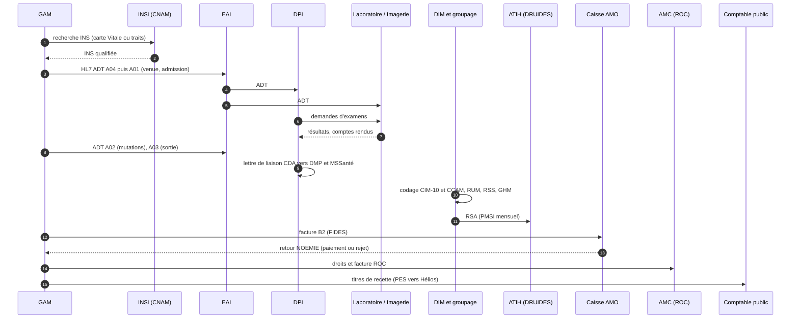

# Un séjour vu par les systèmes

Suivons un séjour fictif du début à la fin, non pas du point de vue du patient
ou des soignants, mais de celui des logiciels. Chaque étape nomme la brique du
SIH concernée, l'échange qu'elle déclenche et la nomenclature qu'elle utilise.
Les chapitres suivants détaillent chacun de ces points.

Camille Martin, 62 ans, arrive un mardi soir aux urgences d'un centre
hospitalier pour une douleur thoracique. Elle sera hospitalisée trois jours en
cardiologie.

## 1. L'accueil : une identité avant tout

L'agent d'accueil des urgences cherche Camille dans la **GAM** (gestion
administrative des malades), le logiciel qui tient le fichier des patients et
des séjours. Camille est déjà venue il y a quatre ans : elle a un **IPP**
(identifiant permanent du patient), le numéro interne de l'établissement.

L'agent lit sa carte Vitale. La GAM interroge le téléservice **INSi** de
l'Assurance Maladie et récupère son **INS** (identité nationale de santé) :
son matricule (le NIR), l'OID de l'autorité qui l'a attribué, et ses traits
d'identité de référence (nom et prénoms de naissance, date de naissance, sexe,
commune de naissance). L'identité passe au statut « qualifiée ». C'est ce
matricule qui permettra de retrouver Camille dans le **DMP** et chez les autres
acteurs de sa prise en charge.

L'agent ouvre une **venue** aux urgences. La GAM émet un message
**HL7 v2 ADT** (admission, discharge, transfer) sur l'**EAI**, le bus
d'intégration de l'hôpital, qui le redistribue à tous les logiciels abonnés :
dossier patient, laboratoire, imagerie, pharmacie.

## 2. Les urgences : premiers actes, premiers résultats

Le médecin urgentiste travaille dans le **DPI** (dossier patient informatisé),
parfois dans un logiciel spécialisé pour les urgences. Il prescrit un bilan
sanguin et un électrocardiogramme. La prescription part vers le **SIL**
(système d'information de laboratoire) sous forme de message HL7 (une
demande d'examens). Une heure plus tard, le SIL renvoie les résultats, avec
des codes d'analyses (**NABM** pour la facturation, souvent **LOINC** pour
l'interopérabilité) et des valeurs structurées, que le DPI intègre dans le
dossier.

Un scanner est demandé. Le **RIS** (système d'information de radiologie)
planifie l'examen, le **PACS** archive les images au format **DICOM**, le
compte rendu revient dans le DPI.

Chaque acte technique réalisé est codé en **CCAM** (classification commune des
actes médicaux) : par exemple un code pour la scanographie thoracique. Ce
code servira à la fois au PMSI et à la facturation.

## 3. L'hospitalisation : des mouvements

Camille est admise en cardiologie. Dans la GAM, la venue aux urgences devient
un **séjour** d'hospitalisation, rattaché à une **UF** (unité fonctionnelle),
la plus petite unité de découpage de l'hôpital. Un **mouvement** d'entrée est
enregistré ; le lendemain elle change de chambre puis passe en unité de
surveillance continue : autant de mouvements, chacun diffusé en HL7 ADT à tous
les systèmes qui ont besoin de savoir où elle est (le DPI pour l'afficher au
bon endroit, la restauration pour livrer le bon plateau, la pharmacie pour
préparer les bonnes doses).

Les prescriptions médicamenteuses passent par le logiciel de prescription
(souvent un module du DPI) vers la **pharmacie à usage intérieur**, avec des
médicaments identifiés par leur code **UCD** (unité commune de dispensation).

## 4. La sortie : documents et destinataires

Le troisième jour, le cardiologue prononce la sortie. La GAM enregistre le
mouvement de sortie avec un mode de sortie (retour au domicile) et diffuse le
message correspondant.

Le DPI produit la **lettre de liaison** de sortie, un document structuré au
format **CDA** défini par le cadre d'interopérabilité **CI-SIS**. Elle est
déposée dans le DMP de Camille, dans **Mon espace santé**, et envoyée à son
médecin traitant par **MSSanté**, la messagerie sécurisée de santé. Les deux
opérations exigent que l'identité de Camille soit qualifiée avec son INS et
que le professionnel émetteur soit identifié par son **RPPS**.

## 5. Le codage : le séjour devient des codes

Dans les jours qui suivent, le **DIM** (département d'information médicale)
vérifie le codage du séjour : diagnostic principal et diagnostics associés en
**CIM-10**, actes en CCAM. Pour chaque unité médicale traversée, un **RUM**
(résumé d'unité médicale) est produit ; l'ensemble forme le **RSS** (résumé de
sortie standardisé).

La **fonction groupage** de l'ATIH classe le séjour dans un **GHM** (groupe
homogène de malades), qui détermine un **GHS** (groupe homogène de séjours),
c'est-à-dire un tarif. Le séjour anonymisé (**RSA**) rejoint l'envoi mensuel
du **PMSI** à l'ATIH via la plateforme **DRUIDES**.

## 6. La facturation : trois payeurs

Le bureau des entrées prépare la facture. Trois payeurs possibles :

- l'**AMO** (assurance maladie obligatoire), dont les droits ont été vérifiés
  en ligne au moment de l'admission ; la part AMO du séjour est facturée soit
  en **facturation individuelle** (**FIDES**), par un flux à la norme **B2**
  vers la caisse, soit encore, pour certains établissements et périmètres, par
  la valorisation des données PMSI ;
- l'**AMC** (assurance maladie complémentaire, la mutuelle de Camille), dont
  les droits ont été consultés et la part calculée via le dispositif **ROC** ;
- Camille elle-même, pour le forfait journalier et la chambre particulière : un
  **titre de recette** est émis.

## 7. Le recouvrement : la caisse répond, le comptable encaisse

La caisse d'assurance maladie traite le flux B2 et renvoie un retour
**NOEMIE** : paiement, ou rejet avec un code motif que le bureau des entrées
devra analyser et corriger. L'AMC répond par le circuit ROC.

L'hôpital public sépare l'**ordonnateur** (qui émet les titres) du
**comptable public** (le Trésor, qui encaisse) : les titres et leurs pièces
partent vers l'application **Hélios** de la DGFiP au format **PES**.

## 8. Après le séjour : les données servent encore

Le séjour de Camille alimente les tableaux de bord de l'hôpital, l'entrepôt de
données de santé pour la recherche s'il en existe un, les statistiques
nationales de l'ATIH et, sous forme pseudonymisée, le **SNDS** (système
national des données de santé).

## Le même parcours en un schéma

## Ce que ce parcours enseigne

- **L'identité est le socle.** Une erreur d'identité se propage dans tous les
  systèmes et jusqu'à la facture. C'est pourquoi l'INS et l'identitovigilance
  occupent tant de place.
- **La GAM est la source de vérité administrative.** Presque tout part d'elle
  et tout le monde écoute ses mouvements.
- **Les nomenclatures sont partout.** CCAM, CIM-10, UCD, NABM : un même code
  sert au soin, au PMSI et à la facture.
- **Trois chaînes coexistent** : la chaîne clinique (DPI, laboratoire,
  imagerie), la chaîne médico-économique (PMSI) et la chaîne financière
  (facturation, recouvrement). Elles partagent les mêmes données mais
  obéissent à des acteurs et des calendriers différents.
