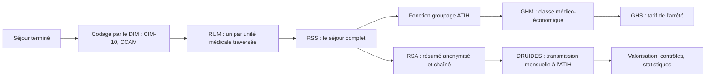

# PMSI et financement

> Dernière vérification des sources : 11 septembre 2026. Les règles et les
> tarifs cités évoluent chaque année ; les liens en fin de chapitre font foi.

Le **PMSI** (programme de médicalisation des systèmes d'information) décrit
l'activité de chaque établissement sous forme de résumés standardisés, un par
séjour, transmis à l'ATIH. Il sert à mesurer l'activité, à comparer les
établissements, et surtout à les financer : c'est le fondement de la
**tarification à l'activité** (T2A).

## Les champs du PMSI

| Champ | Périmètre | Unité de recueil |
|---|---|---|
| **MCO** | médecine, chirurgie, obstétrique, odontologie | le séjour (RSS) |
| **SMR** (soins médicaux et de réadaptation, ex-SSR depuis 2023) | rééducation, réadaptation | la semaine de présence (RHS) |
| **HAD** | hospitalisation à domicile | la séquence de soins (RPSS) |
| **Psychiatrie** (RIM-P) | hospitalisation et ambulatoire en psychiatrie | le séjour et l'acte ambulatoire |

Ce chapitre détaille le MCO, le plus répandu ; les autres champs suivent la
même logique avec leurs propres formats et classifications.

## La chaîne du MCO

### Le codage

Le **DIM** (département d'information médicale), sous la responsabilité d'un
médecin, vérifie et complète le codage de chaque séjour :

- le **diagnostic principal** (DP), le problème de santé qui a motivé
  l'essentiel du séjour ;
- le **diagnostic relié** (DR) et les **diagnostics associés** (DAS), qui
  précisent le contexte et les comorbidités ;
- les **actes** CCAM réalisés, avec leur date ;
- des variables administratives venues de la GAM : âge, sexe, modes d'entrée
  et de sortie, durée, unités médicales.

Le codage suit le **guide méthodologique de production des informations**
publié chaque année par l'ATIH : il fixe ce qui est un DP, comment coder une
complication, etc. Ces règles ont un impact financier direct.

### RUM, RSS, RSA

- Le **RUM** (résumé d'unité médicale) décrit le passage du patient dans une
  **unité médicale** : dates, diagnostics, actes.
- Le **RSS** (résumé de sortie standardisé) est l'ensemble des RUM d'un même
  séjour ; un séjour mono-unité a un RSS d'un seul RUM.
- Le **RSA** (résumé de sortie anonyme) est le RSS débarrassé des
  identifiants directs, mais complété d'un **numéro de chaînage** : le NIR, la
  date de naissance et le sexe passent par une fonction de hachage
  irréversible (la fonction FOIN) qui permet de relier les séjours d'un même
  patient sans l'identifier.

### Le groupage

La **fonction groupage** est un programme fourni par l'ATIH, intégré dans les
logiciels du DIM, qui classe chaque RSS dans un **GHM** (groupe homogène de
malades). Un code GHM se lit ainsi : `01C031` par exemple (présent dans le fichier tarifaire de l'ATIH), où
`01` est la **catégorie majeure de diagnostic** (affections du système
nerveux), `C` le type (chirurgical ; `K` interventionnel non chirurgical, `M`
médical, `Z` indifférencié), `03` le numéro de la racine, et le dernier caractère le
**niveau de sévérité** (`1` à `4`, `J` pour l'ambulatoire, `T` pour les très
courts séjours).

À chaque GHM correspond un ou plusieurs **GHS** (groupes homogènes de
séjours), qui portent le tarif. La plupart des GHM ont un seul GHS ; certains
en ont plusieurs selon les conditions de prise en charge.

Les erreurs de groupage sont signalées par des codes retour ; un séjour peut
aussi être classé en « erreur » (CMD 90) si des données indispensables
manquent.

## La T2A en pratique

Le tarif d'un séjour MCO se compose de :

- le **tarif du GHS**, différent pour le secteur public (tarifs « ex-DG ») et
  le secteur privé (tarifs « ex-OQN »), avec des **bornes** : au-dessous de la
  borne basse un forfait ou une minoration (EXB), au-dessus de la borne haute
  un supplément journalier (EXH) ;
- des **suppléments journaliers** pour certaines unités : réanimation (REA),
  soins intensifs (STF), surveillance continue (SRC), néonatologie (NN1 à
  NN3), etc. ;
- des **forfaits** et des molécules ou dispositifs facturés en sus de la liste
  en sus ;
- des coefficients (géographique, prudentiel, de transition).

Les tarifs sont fixés chaque année par un **arrêté tarifaire**, publié au
Journal officiel et repris en fichiers par l'ATIH. Ils s'appliquent aux
séjours **sortis** à partir de la date d'effet, historiquement le 1er mars ;
la campagne 2026 a pris effet au 1er janvier.

Le financement des établissements ne se réduit pas aux GHS : dotations
(**MIGAC** pour les missions d'intérêt général et l'aide à la
contractualisation, **DAF** pour la psychiatrie et une partie du SMR),
forfaits (urgences, activités isolées), et depuis les réformes récentes une
part de **dotation populationnelle** et de financement à la qualité (IFAQ).
La réforme du financement engagée en 2024 fait évoluer ces équilibres ;
suivez les notices techniques de l'ATIH.

## La transmission : DRUIDES et e-PMSI

Chaque mois, l'établissement produit ses fichiers PMSI (RSA, fichiers de
facturation associés, fichiers d'actes et de médicaments) et les transmet à
l'ATIH via **DRUIDES**, le logiciel de transmission unique depuis 2023 pour le
MCO, étendu en 2024 et 2025 au SMR, à la psychiatrie et à l'HAD. La plateforme
**e-PMSI** restitue les contrôles, la valorisation et les tableaux de bord
(dont les tableaux OVALIDE). Les données agrégées sont publiées sur
**ScanSanté**.

Les envois sont **cumulatifs** : l'envoi de mai contient les séjours de
janvier à mai. Cela permet de corriger un codage après coup, dans les limites
du calendrier de campagne (la clôture de l'année, appelée LAMDA pour les
corrections tardives, obéit à des règles précises).

## Ce que ça change dans votre code

- **Un séjour PMSI n'est pas un séjour GAM.** Le RSS suit les unités
  médicales, la GAM suit les UF et les mouvements ; les correspondances UF
  vers UM et les règles de découpage sont un travail à part entière.
- **La date de sortie détermine presque tout** : campagne, version des
  formats, tarif applicable.
- **Ne recodez pas le groupage.** Utilisez la fonction groupage officielle ;
  vos calculs de simulation doivent être présentés comme tels.
- **Les fichiers PMSI sont à longueur fixe** et changent de format chaque
  année : lisez les positions dans le format publié, jamais dans un exemple.
- **Le chaînage est une pseudonymisation, pas une anonymisation** : ces données
  restent des données de santé à protéger.

## Pour aller plus loin

- ATIH, [guides méthodologiques et formats PMSI](https://www.atih.sante.fr/)
- ATIH, [tarifs MCO et HAD](https://www.atih.sante.fr/tarifs-mco-et-had)
- ATIH, [DRUIDES](https://www.atih.sante.fr/) et documentation e-PMSI
- Légifrance, arrêtés annuels fixant les tarifs des prestations d'hospitalisation
