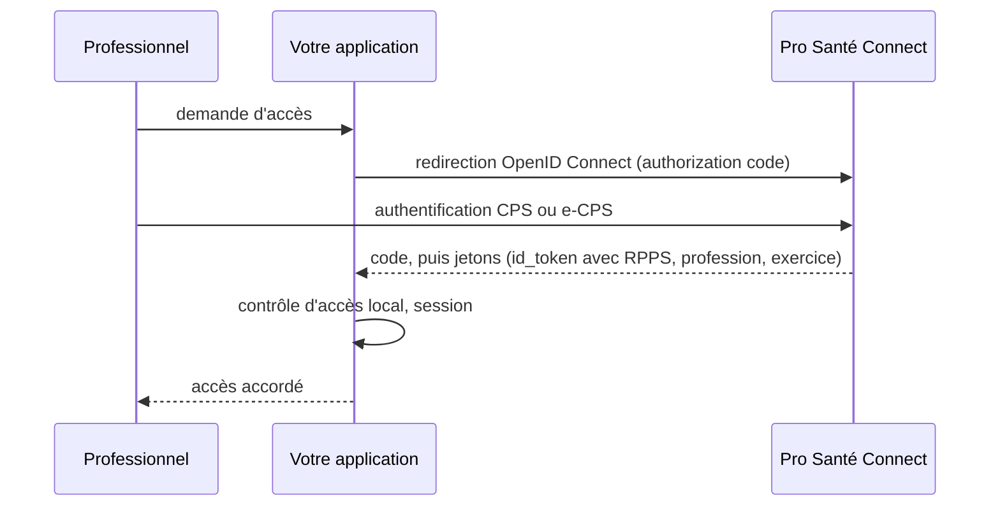

# Professionnels, identification et sécurité

> Dernière vérification des sources : 11 septembre 2026. Les règles et les
> tarifs cités évoluent chaque année ; les liens en fin de chapitre font foi.

## Identifier les professionnels

| Identifiant ou moyen | Ce que c'est | Qui le délivre |
|---|---|---|
| **RPPS** (répertoire partagé des professionnels intervenant dans le système de santé) | identifiant national à 11 chiffres, à vie, de chaque professionnel ; il porte aussi ses diplômes, ses situations d'exercice et ses structures | ANS, alimenté par les ordres et les employeurs |
| **ADELI** | ancien répertoire des professions non ordinales, absorbé progressivement dans le RPPS | ARS historiquement |
| **CPS** (carte de professionnel de santé) | carte à puce avec certificats, pour l'authentification forte et la signature | ANS |
| **e-CPS** | application mobile équivalente à la CPS | ANS |
| **Pro Santé Connect** | fournisseur d'identité national fondé sur OpenID Connect, qui accepte CPS et e-CPS | ANS |
| Compte Active Directory, badge | identité interne de l'établissement, pour le poste de travail et le SSO | la DSI |

L'**annuaire santé** publie une partie du RPPS en libre accès (identité
professionnelle, profession, structures d'exercice) et l'expose en API FHIR.

## Pro Santé Connect

Depuis le 1er janvier 2023, les services numériques nationaux et régionaux
de santé, et les services locaux qui leur sont fortement intégrés, doivent
proposer **Pro Santé Connect** comme moyen d'identification électronique.
C'est aussi une exigence du référencement Ségur pour de nombreux logiciels.

Techniquement, c'est un flux **OpenID Connect** standard : votre application
redirige l'utilisateur vers Pro Santé Connect, il s'authentifie avec sa CPS ou
son e-CPS, et vous recevez un jeton d'identité contenant ses traits
(identifiant RPPS, nom, profession, spécialités, situations d'exercice). À
vous ensuite d'en déduire ses droits dans votre application.

Un bac à sable est disponible pour les développeurs ; les identités de test y
sont fictives.

## Les cadres de sécurité

### PGSSI-S

La **PGSSI-S** (politique générale de sécurité des systèmes d'information de
santé), publiée par l'ANS, rassemble des référentiels opposables ou
recommandés : identification électronique des acteurs, imputabilité,
authentification des patients, gestion des habilitations, sauvegarde,
journalisation. Un projet hospitalier y fait référence pour justifier ses
choix.

### HDS

Toute personne qui héberge des données de santé pour le compte d'un tiers doit
être **certifiée HDS** (hébergeur de données de santé). Un hôpital qui héberge
ses propres données n'a pas besoin de la certification ; un prestataire cloud,
un éditeur en mode SaaS, un infogérant, oui. Dans un appel d'offres, c'est un
critère éliminatoire.

### RGPD et données de santé

Les données de santé sont des données sensibles. Chaque traitement est inscrit
au registre de l'établissement, sous la responsabilité du **DPO** (délégué à la
protection des données), avec une base légale, une durée de conservation et
des mesures de sécurité. La CNIL publie des référentiels sectoriels (dont un
pour la gestion des cabinets et pour la recherche). Les **entrepôts de données
de santé** à visée de recherche relèvent d'un référentiel spécifique et
d'autorisations.

### Habilitations et traçabilité

Deux exigences reviennent dans tous les audits (certification des comptes,
certification HAS, PGSSI-S) :

- **des habilitations justifiées** : qui a demandé quel accès, qui l'a
  validé, quand il a été révoqué, avec les preuves ;
- **une traçabilité des accès** aux dossiers, exploitable en cas de
  signalement.

Un outil libre dédié au registre des habilitations et au coffre à preuves
d'audit, conçu pour les établissements de santé, est présenté dans
[Données publiques](donnees-publiques.md).

### Cybersécurité : CaRE et CERT Santé

Après les attaques qui ont touché plusieurs hôpitaux, le programme **CaRE**
(cybersécurité accélération et résilience des établissements) finance depuis
2023 des audits, des exercices de crise et des remises à niveau (annuaire,
sauvegardes, segmentation, exposition sur Internet). Le **CERT Santé** de
l'ANS reçoit les signalements d'incidents, qui sont obligatoires pour les
établissements.

## Ce que ça change dans votre code

- **Authentifiez par le fournisseur d'identité, autorisez chez vous.** Pro
  Santé Connect ou l'annuaire de l'établissement disent qui est là ; votre
  application décide de ce qu'il peut faire, avec un modèle de rôles explicite.
- **Chaque accès à une donnée de patient est journalisé** : qui, quoi, quand,
  depuis où. Un journal infalsifiable (chaîné) vaut mieux qu'une table
  modifiable.
- **Le compte de service n'est pas une personne.** Les flux techniques ont
  leurs identités, leurs certificats et leurs journaux propres.
- **Pas de données réelles hors production.** Anonymisation ou jeux
  synthétiques pour les tests, la formation et la démonstration.
- **Prévoyez la révocation.** Départ d'un agent, changement de service :
  vos habilitations doivent pouvoir être coupées vite et prouvées après coup.
- **Hébergement** : si votre solution héberge des données pour l'hôpital,
  HDS n'est pas une option.

## Pour aller plus loin

- ANS, [Pro Santé Connect](https://esante.gouv.fr/produits-services/pro-sante-connect) et sa documentation technique
- ANS, [PGSSI-S](https://esante.gouv.fr/produits-services/pgssi-s)
- ANS, [certification HDS](https://esante.gouv.fr/produits-services/hds)
- CNIL, [santé](https://www.cnil.fr/fr/sante)
